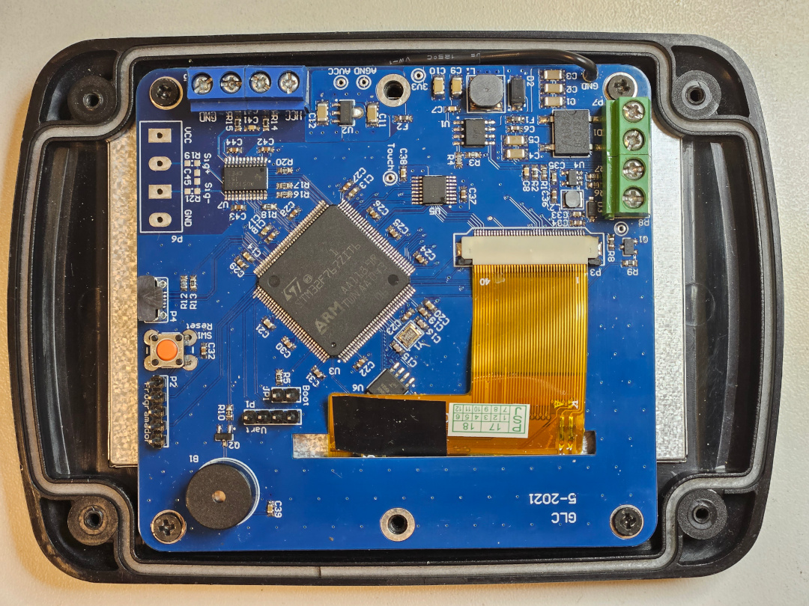
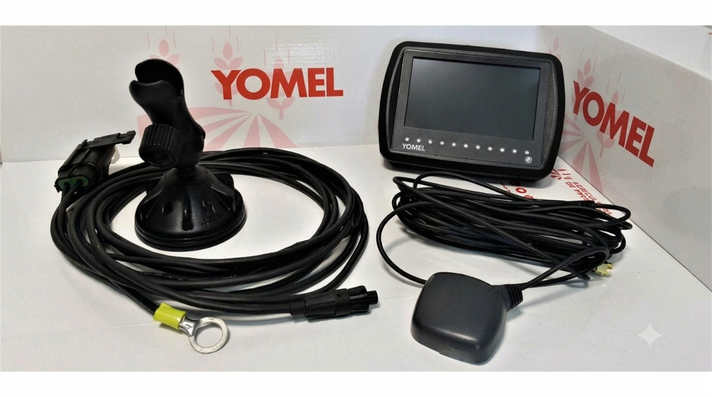
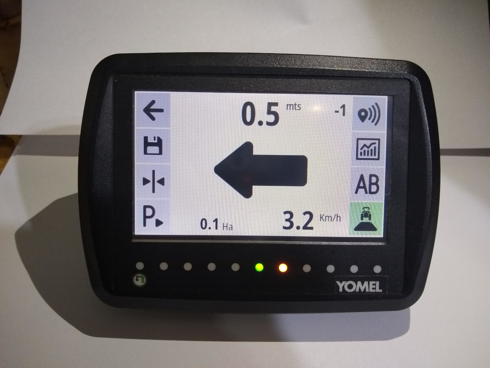
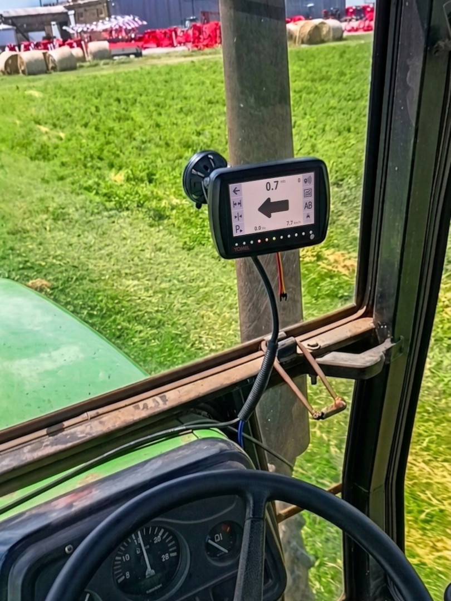
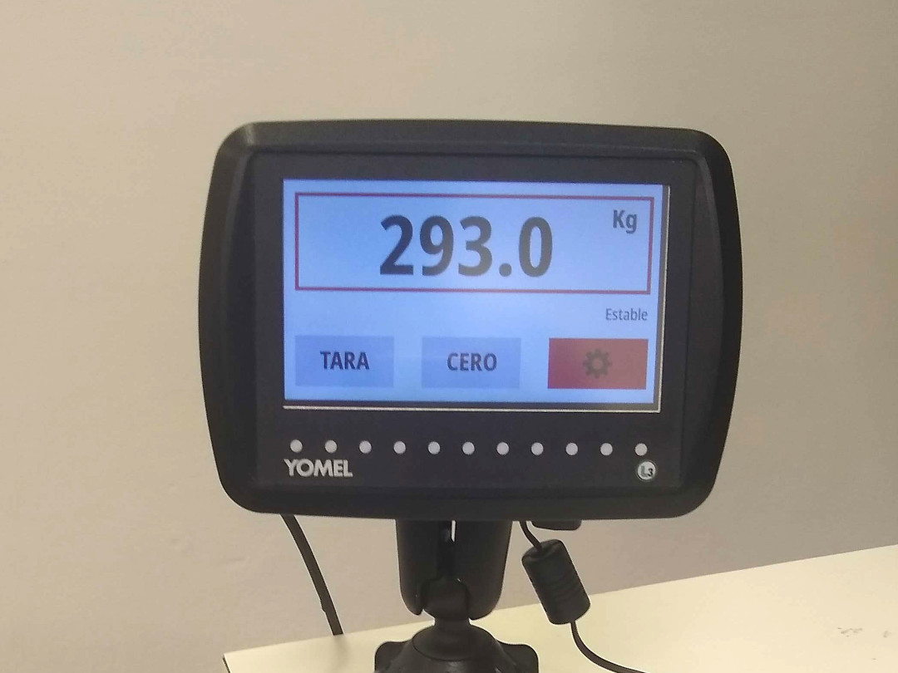
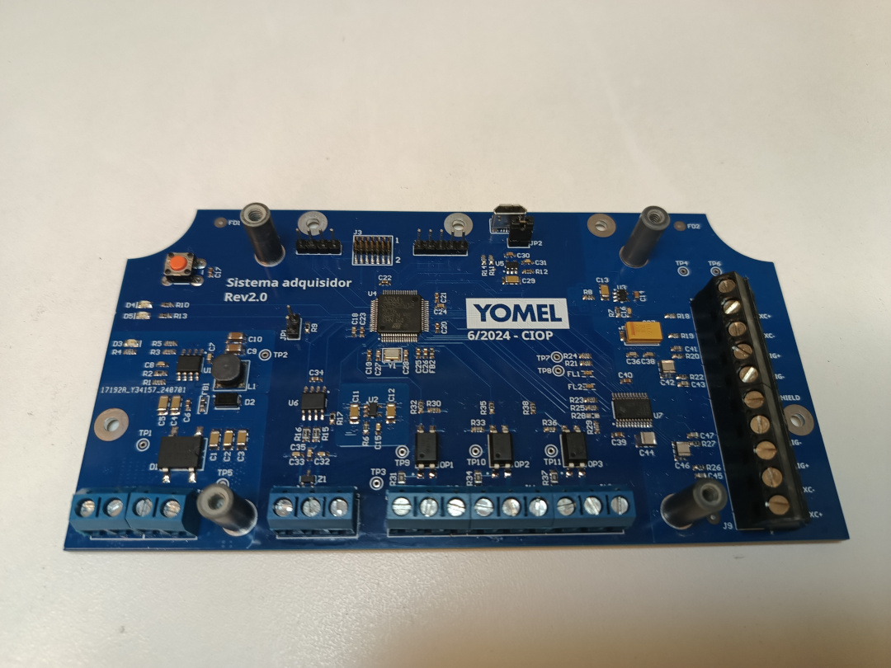
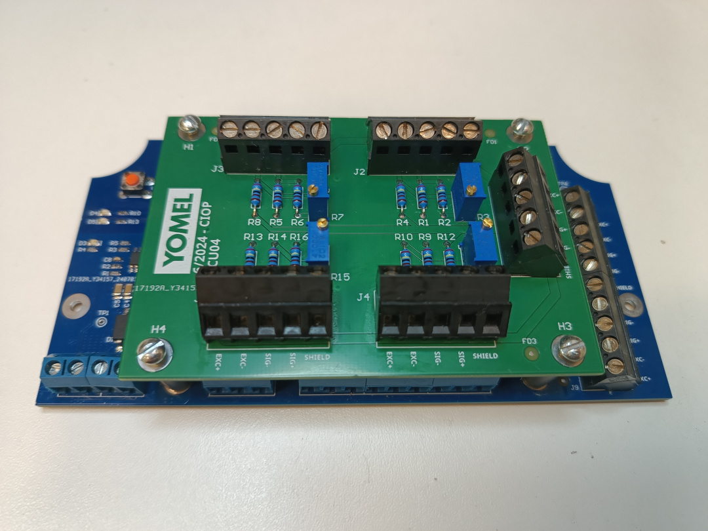
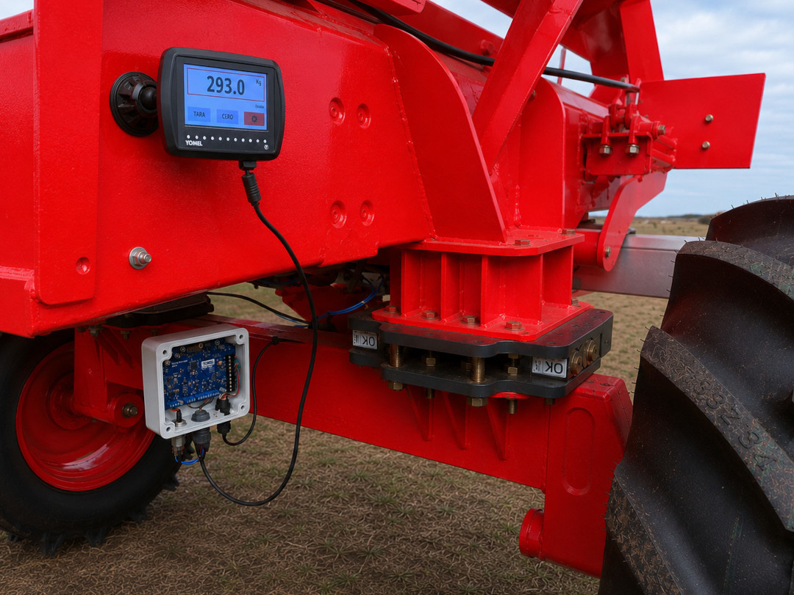

# TRANSFERENCIA TECNOLÓGICA E INGENIERÍA APLICADA

Grupo de Desarrollo Electrónico

<!-- Imgagenes para el posible fondo -->
<!-- images\fondo\f1.jpg -->
<!-- images\fondo\f2.jpg -->
<!-- images\fondo\f3.jpg -->
<!-- images\fondo\f4.jpg -->
<!-- images\fondo\f5.jpg -->
<!-- images\fondo\f6.jpg -->
<!-- images\fondo\f7.jpg -->

## NUESTRAS CAPACIDADES

1. ELECTRÓNICA

- Diseño analógico y digital
- Diseño de PCB
- EMC / EMI
- Fuentes y potencia
- Sensores e interfaces

2. PROTOTIPADO Y VALIDACIÓN

- Laboratorio electrónico
- Ensayos funcionales
- Integración de sistemas
- Pruebas de campo
- Producción pequeña serie

3. SISTEMAS EMBEBIDOS

- STM32 / ESP32 / RPi / SoC / SBC / COM
- Microcontroladores
- RTOS
- Bajo consumo
- Drivers y fírmware

4. SOFTWARE

- Aplicaciones de escritorio
- Interfaces gráficas
- Procesamiento de datos
- Registro y análisis
- Herramientas a medida

5. COMUNICACIONES

- CAN Bus
- ISOBUS
- RS485 / Modbus
- Ethernet
- GNSS
- IoT / Telemetría

6. INSTRUMENTACIÓN

- Celdas de carga
- Adquisición de datos
- Calibración
- Metrología
- Acondicionamiento de señales

## PROYECTOS DESTACADOS

1. BANDERILLERO SATELITAL

- Posicionamiento de alta precisión mediante redes GNSS
- Guiado visual mediante pantalla táctil y sistema de luces indicadoras
- Interfaz de usuario intuitiva y de fácil instalación
- Electrónica y software desarrollados integramente
- Configuración de parámetros del equipo (idioma, brillo y sonido)
- Electrónica, firmware y software desarrollados íntegramente por nuestro equipo

2. SISTEMA DE PESAJE PARA APLICACIONES AGROPECUARIA

- Electrónica de adquisición de alta precisión para celdas de carga
- Funciones de cero, tara y calibración
- Configuración de parámetros del instrumento
- Integración con banderillero satelital para cálculo de dosis y monitoreo de aplicación
- Monitor con pantalla táctil
- Comunicación mediante red CAN
- Amplias opciones de configuración para distintos tipos de celdas de carga e instalaciones
- Funciones específicas para fertilizadoras y equipos agrícolas

3. CONTROLADOR PARA FERTILIZADORAS NEUMÁTICAS DE MICROGRANULADOS Y SEMBRADORAS DE PASTURAS

- Control electrónico del motor soplador y del sistema dosificador
- Monitor con pantalla táctil de 7 pulgadas
- Comunicación entre ECU y monitor mediante protocolo compatible con ISOBUS
- Integración de sensores de velocidad, nivel de producto y vaciado de tolva
- Regulación automática de la dosis en función de la velocidad de avance
- Monitoreo en tiempo real de los principales parámetros de trabajo
- Configuración y diagnóstico desde la interfaz de usuario
- Electrónica y software desarrollados íntegramente por nuestro equipo

## PROBLEMA -> DISEÑO -> PROTOTIPO -> VALIDACIÓN -> PRODUCTO

## RESULTADOS OBTENIDOS

Experiencia en desarrollos transferidos a la industria.

- Prototipos funcionales validados
- Electrónica de diseño propio
- Software desarrollado a medida
- Ensayos de laboratorio y campo
- Transferencia de know-how
- Acompañamiento en industrialización

INNOVACIÓN QUE SE TRANSFORMA EN SOLUCIONES CONCRETAS

## Datos de contacto

Web CIOp:
https://ciop.conicet.gov.ar/

Correo:
vinculacion@ciop.unlp.edu.ar

Instagram:
@ciop.web

Dirección:
Camino Centenario y 506, M. B. Gonnet - Buenos Aires, Argentina.

